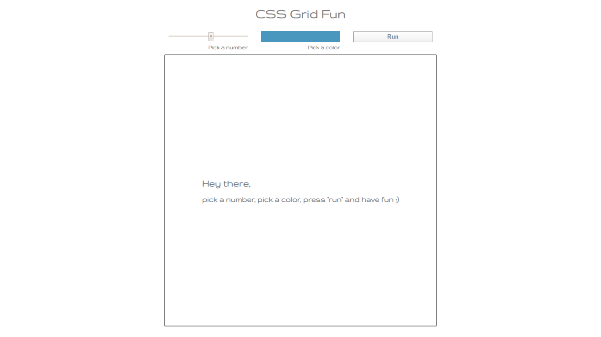
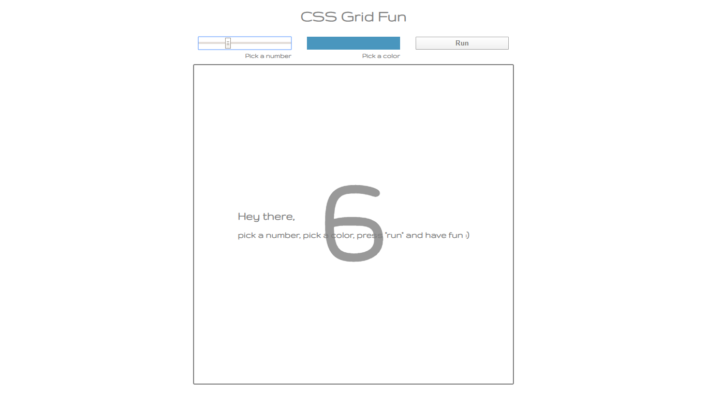
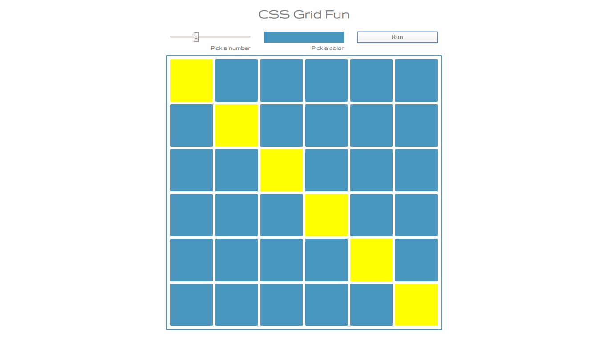
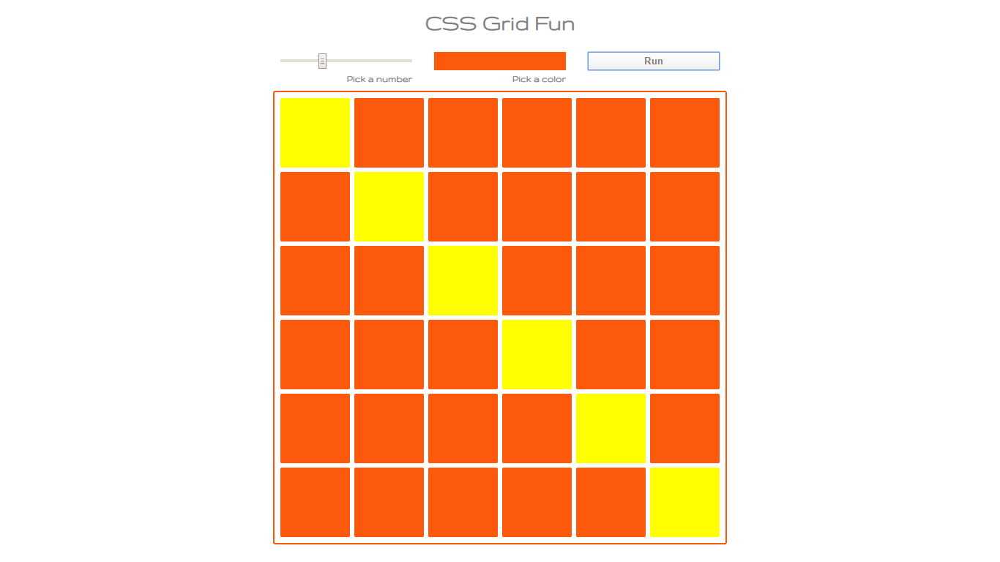

## CSS Grid (Front End Course - Coding Challenge)

### Task list:

```
• Create an HTML page that has one <input> to choose number from 2 to 15,
  one <input> to choose color and one <button>.

• Write a code that by clicking the "run" button for the selected integer x draw x*x number of squares
  in the selected color, across square shape div.

• The diagonal from the upper left, to the lower right, should always be painted in yellow.
```





